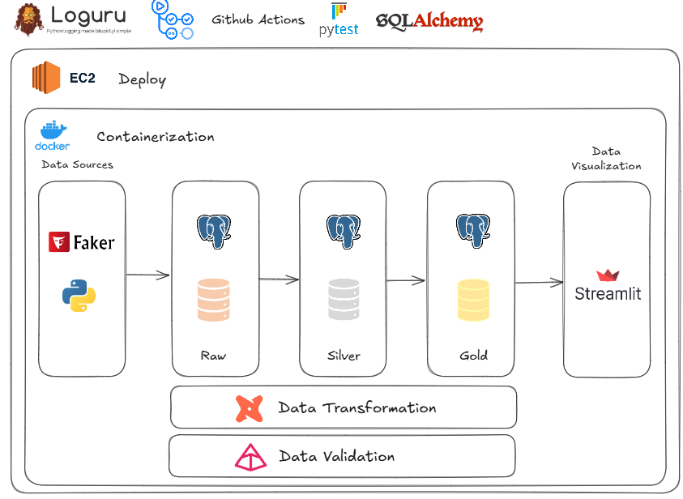

# Shoptech: Projeto de Caso de Estudo em Engenharia de Dados

[[EN-US Documentation ↓]](#shoptech-data-engineering-case-study-project)


Bem-vindo ao repositório do projeto fictício Shoptech, um e-commerce especializado em eletrônicos e gadgets, criado para fins de estudo e aplicação prática de conceitos de Engenharia de Dados.

## Conteúdos

- [Sobre o Projeto](#sobre-projeto)
- [Objetivo do Caso de Estudo](#objetivo-do-caso-de-estudo)
- [Principais Etapas do Projeto](#principais-etapas-do-projeto)
- [Arquitetura do Projeto](#arquitetura-do-projeto)
- [Estrutura do Projeto](#estrutura-do-projeto)
- [Tecnologias Utilizadas](#tecnologias-utilizadas)
- [Como Executar o Projeto](#como-executar-o-projeto)
- [Acessando o site de análises](#acessando-o-site-de-análises)
<!-- - [Further Improvements](#further-improvements) -->

## Sobre o Projeto

O objetivo deste projeto é simular um cenário realista de um e-commerce, onde grandes volumes de dados precisam ser coletados, processados, armazenados e analisados. A Shoptech serve como pano de fundo para demonstrar habilidades técnicas e práticas relacionadas a pipelines de dados, modelagem de banco de dados, transformações ETL e análises de dados.

Os dados utilizados no projeto são gerados randomicamente e não representam informações reais. Este projeto é idealizado como um case fictício para demonstrar conhecimento técnico em um contexto realista e relevante para o mercado.

## Objetivo do Caso de Estudo

[Topo ⤴︎](#conteúdos)

O principal objetivo do projeto Shoptech é criar um ambiente completo para:

- Simular o fluxo de dados de um e-commerce: da captura (compra do cliente) até a análise de métricas de desempenho.
- Demonstrar boas práticas em engenharia de dados, incluindo ingestão, transformação e armazenamento de dados.
- Aplicar ferramentas e frameworks modernos utilizados no setor, como Python, SQL, dbt, Streamlit e mais.
- Visualizar insights gerados a partir dos dados processados, simulando relatórios para acompanhamento de métricas de negócios.

## Principais Etapas do Projeto

[Topo ⤴︎](#conteúdos)

### 1. Geração de Dados Sintéticos

  Uso de bibliotecas como Faker para criar dados realistas.

### 2. Ingestão de Dados
  
  Construção de pipelines para ingestão de dados brutos provenientes de múltiplas fontes simuladas (ex.: logs de navegação, transações, inventário).

### 3. Transformação de Dados

  Aplicação de processos ELT (Extract, Load, Transform) para limpeza, normalização e enriquecimento dos dados.

### 4. Modelagem e Armazenamento

  Design de um Data Warehouse com esquema estrela.

### 5. Análise e Visualização

  Criação de consultas com dados agregados e KPI's, disponibilizando em um front-end construído com Streamlit

## Tecnologias Utilizadas

[Topo ⤴︎](#conteúdos)

- 💻 **Backend**
  - [Faker](https://fastapi.tiangolo.com/) para criação de dados transacionais fictícios da Shoptech.
  - [SQLAlchemy](https://www.sqlalchemy.org/) para interações com bancos de dados SQL em Python (ORM).
  - [PostgreSQL](https://www.postgresql.org/)
  - [Alembic](https://alembic.sqlalchemy.org/en/latest/) para migração de banco de dados
  - Testes com [Pytest](https://docs.pytest.org/en/stable/) e [Testcontainers](https://testcontainers-python.readthedocs.io/en/latest/).
  - [Pre-commit](https://pre-commit.com/) com [Ruff](https://docs.astral.sh/ruff/) para análises estáticas e formatações de código.
  - CI (Integração contínua) com GitHub Actions.
  - [Loguru](https://loguru.readthedocs.io/en/stable/) para monitoramente e observabilidade  das aplicações
  - [dbt](https://www.getdbt.com/) para transformação dos dados

- 🌐 **Frontend**
  - [Streamlit](https://streamlit.io/) para criação de interface gráfica (front-end)

## Arquitetura do Projeto

[Topo ⤴︎](#conteúdos)



## Estrutura do Projeto

[Topo ⤴︎](#conteúdos)

```
   .gitignore
│   .pre-commit-config.yaml
│   .python-version
│   docker-compose.yml
│   my_tree_structure.txt
│   poetry.lock
│   pyproject.toml
│   README.md
│   
├───.github
│   └───workflows
│           ci-backend.yaml
│
├───backend
│   │   .dockerignore
│   │   .env
│   │   alembic.ini
│   │   Dockerfile
│   │   entrypoint.sh
│   │   requirements.txt
│   │
│   ├───migrations
│   │   │   env.py
│   │   │   README
│   │   │   script.py.mako
│   │   │
│   │   └───versions
│   │           40c00f53910a_create_tables.py
│   │
│   ├───src
│   │   │   database.py
│   │   │   load.py
│   │   │   models.py
│   │   │   schemas.py
│   │   │   settings.py
│   │   │
│   │   └───data
│   │           customers.py
│   │           orders.py
│   │           products.py
│   │
│   └───tests
│       │   conftest.py
│       │   test_models.py
│       │
│       └───data
│               test_customer_generator.py
│               test_product_generator.py
│
├───frontend
│   │   .dockerignore
│   │   .env
│   │   Dockerfile
│   │   main.py
│   │   requirements.txt
│   │
│   ├───.streamlit
│   │       config.toml
│   │       secrets.toml
│   │
│   ├───modules
│   │       nav.py
│   │
│   └───pages
│           customer_profile.py
│           fct_orders.py
│           mom_variance.py
│           revenue_tier_per_customer.py
│           sales_by_region.py
│           sub_category_sales_and_margin.py
│           top10_sales_products_with_margin_ranking.py
│           yoy_variance.py
│
└───shoptech_dbt
    │   .gitignore
    │   dbt_project.yml
    │   Dockerfile
    │   profiles.yml
    │   README.md
    │   requirements.txt
    │
    ├───analyses
    │       .gitkeep
    │
    ├───macros
    │       .gitkeep
    │       generate_schema_name.sql
    │       test_not_negative_and_zero_values.sql
    │
    ├───models
    │   ├───docs
    │   │       customers_docs.md
    │   │       orders_docs.md
    │   │       products_docs.md
    │   │
    │   ├───marts
    │   │   └───sales
    │   │           customer_profile.sql
    │   │           fct_orders.sql
    │   │           mom_variance.sql
    │   │           revenue_tier_per_customer.sql
    │   │           sales_by_region.sql
    │   │           sub_category_sales_and_margin.sql
    │   │           top10_margin_products_with_sales_ranking.sql
    │   │           top10_product_sales.sql
    │   │           top10_sales_products_with_margin_ranking.sql
    │   │           yoy_variance_mtd.sql
    │   │           yoy_variance_ytd.sql
    │   │
    │   └───staging
    │           stg_shoptech__customers.sql
    │           stg_shoptech__customers.yml
    │           stg_shoptech__orders.sql
    │           stg_shoptech__orders.yml
    │           stg_shoptech__products.sql
    │           stg_shoptech__products.yml
    │           _shoptech__sources.yml
    │
    ├───seeds
    │       .gitkeep
    │
    ├───snapshots
    │       .gitkeep
    │
    └───tests
            .gitkeep
            assert_delivery_date_higher_shipping_date.sql
            assert_eta_higher_shipping_date.sql
            assert_shipping_date_higher_order_date.sql
```

## Como Executar o Projeto

[Topo ⤴︎](#conteúdos)

Antes de rodar o projeto, você precisa ter o Docker Compose instalado. Se ainda não tiver, siga o guia de instalação oficial:

[Como instalar Docker Compose](https://docs.docker.com/compose/install/)

### 1. Clonar o Repositório

Clone o repositório para sua máquina local:

```bash
git clone git@github.com:vgrcontreras/shoptech.git
```

### 2. Acesse o repositório do projeto

Depois de clonar o repositório, entre no diretório do projeto:

```bash
cd shoptech
```

### 3. Subir os Containers com Docker Compose

Agora, use o Docker Compose para construir e rodar os containers do projeto:

```bash
docker-compose up -d --build
```

Isso irá iniciar todos os serviços necessários para rodar o projeto. Aguarde até que todos os containers estejam em execução.

❗O tempo médio de inicialização para que todos os containeres estejam em execução é de 90 segundos.

## Acessando o site de análises

[Topo ⤴︎](#conteúdos)

Após todos os containeres estarem em execução, abra o navegador e acesse http://localhost:8501 para ver sa aplicação  web em ação!

Ou [clique aqui](http://ec2-34-224-85-153.compute-1.amazonaws.com:8501/)

## [English Version]

# Shoptech: Data Engineering Case Study Project

[[PT-BR Documentation ↑]](#shoptech-projeto-de-caso-de-estudo-em-engenharia-de-dados)


Welcome to the repository of the fictional Shoptech project, an e-commerce platform specializing in electronics and gadgets, created for study purposes and practical application of Data Engineering concepts.

## Contents

- [About the Project](#about-the-project)
- [Case Study Objective](#case-study-objective)
- [Main Project Stages](#main-project-stages)
- [Project Architecture](#project-architecture)
- [Project Structure](#project-structure)
- [Technologies Used](#technologies-used)
- [How to Run the Project](#how-to-run-the-project)
- [Accessing the Analysis Website](#accessing-the-analysis-website)

## About the Project

The goal of this project is to simulate a realistic e-commerce scenario where large volumes of data need to be collected, processed, stored, and analyzed. Shoptech serves as a backdrop to demonstrate technical and practical skills related to data pipelines, database modeling, ETL transformations, and data analysis.

The data used in the project is randomly generated and does not represent real information. This project is designed as a fictional case study to showcase technical knowledge in a realistic and market-relevant context.

## Case Study Objective

[Top ⤴︎](#contents)

The main objective of the Shoptech project is to create a complete environment to:

- Simulate the data flow of an e-commerce platform: from customer purchase capture to performance metric analysis.
- Demonstrate best practices in data engineering, including data ingestion, transformation, and storage.
- Apply modern tools and frameworks used in the industry, such as Python, SQL, dbt, Streamlit, and more.
- Visualize insights generated from processed data, simulating reports for business metric tracking.

## Main Project Stages

[Top ⤴︎](#contents)

### 1. Synthetic Data Generation

  Using libraries like Faker to create realistic data.

### 2. Data Ingestion
  
  Building pipelines to ingest raw data from multiple simulated sources (e.g., navigation logs, transactions, inventory).

### 3. Data Transformation

  Applying ELT (Extract, Load, Transform) processes for data cleaning, normalization, and enrichment.

### 4. Modeling and Storage

  Designing a Data Warehouse using a star schema.

### 5. Analysis and Visualization

  Creating queries with aggregated data and KPIs, making them available on a front-end built with Streamlit.

## Technologies Used

[Top ⤴︎](#contents)

- 💻 **Backend**
  - [Faker](https://fastapi.tiangolo.com/) for generating fictional transactional data for Shoptech.
  - [SQLAlchemy](https://www.sqlalchemy.org/) for SQL database interactions in Python (ORM).
  - [PostgreSQL](https://www.postgresql.org/)
  - [Alembic](https://alembic.sqlalchemy.org/en/latest/) for database migrations.
  - Testing with [Pytest](https://docs.pytest.org/en/stable/) and [Testcontainers](https://testcontainers-python.readthedocs.io/en/latest/).
  - [Pre-commit](https://pre-commit.com/) with [Ruff](https://docs.astral.sh/ruff/) for static analysis and code formatting.
  - CI (Continuous Integration) with GitHub Actions.
  - [Loguru](https://loguru.readthedocs.io/en/stable/) for application monitoring and observability.
  - [dbt](https://www.getdbt.com/) for data transformation.

- 🌐 **Frontend**
  - [Streamlit](https://streamlit.io/) for building the graphical interface (front-end).

## Project Architecture

[Top ⤴︎](#contents)


## Project Structure

[Top ⤴︎](#contents)

```
   .gitignore
│   .pre-commit-config.yaml
│   .python-version
│   docker-compose.yml
│   my_tree_structure.txt
│   poetry.lock
│   pyproject.toml
│   README.md
│   
├───.github
│   └───workflows
│           ci-backend.yaml
│
├───backend
│   │   .dockerignore
│   │   .env
│   │   alembic.ini
│   │   Dockerfile
│   │   entrypoint.sh
│   │   requirements.txt
│   │
│   ├───migrations
│   │   │   env.py
│   │   │   README
│   │   │   script.py.mako
│   │   │
│   │   └───versions
│   │           40c00f53910a_create_tables.py
│   │
│   ├───src
│   │   │   database.py
│   │   │   load.py
│   │   │   models.py
│   │   │   schemas.py
│   │   │   settings.py
│   │   │
│   │   └───data
│   │           customers.py
│   │           orders.py
│   │           products.py
│   │
│   └───tests
│       │   conftest.py
│       │   test_models.py
│       │
│       └───data
│               test_customer_generator.py
│               test_product_generator.py
│
├───frontend
│   │   .dockerignore
│   │   .env
│   │   Dockerfile
│   │   main.py
│   │   requirements.txt
│   │
│   ├───.streamlit
│   │       config.toml
│   │       secrets.toml
│   │
│   ├───modules
│   │       nav.py
│   │
│   └───pages
│           customer_profile.py
│           fct_orders.py
│           mom_variance.py
│           revenue_tier_per_customer.py
│           sales_by_region.py
│           sub_category_sales_and_margin.py
│           top10_sales_products_with_margin_ranking.py
│           yoy_variance.py
│
└───shoptech_dbt
    │   .gitignore
    │   dbt_project.yml
    │   Dockerfile
    │   profiles.yml
    │   README.md
    │   requirements.txt
    │
    ├───analyses
    │       .gitkeep
    │
    ├───macros
    │       .gitkeep
    │       generate_schema_name.sql
    │       test_not_negative_and_zero_values.sql
    │
    ├───models
    │   ├───docs
    │   │       customers_docs.md
    │   │       orders_docs.md
    │   │       products_docs.md
    │   │
    │   ├───marts
    │   │   └───sales
    │   │           customer_profile.sql
    │   │           fct_orders.sql
    │   │           mom_variance.sql
    │   │           revenue_tier_per_customer.sql
    │   │           sales_by_region.sql
    │   │           sub_category_sales_and_margin.sql
    │   │           top10_sales_products_with_margin_ranking.sql
    │   │           yoy_variance_mtd.sql
    │   │           yoy_variance_ytd.sql
    │
```

## How to Run the Project

[Top ⤴︎](#contents)

Before running the project, you need to have Docker Compose installed. If you haven't installed it yet, follow the official installation guide:

[How to Install Docker Compose](https://docs.docker.com/compose/install/)

### 1. Clone the Repository

```bash
git clone git@github.com:vgrcontreras/shoptech.git
```

### 2. Access the Project Repository

```bash
cd shoptech
```

### 3. Start the Containers with Docker Compose

```bash
docker-compose up -d --build
```

## Accessing the Analysis Website

[Top ⤴︎](#contents)

Go to http://localhost:8501 or [click here](http://ec2-34-224-85-153.compute-1.amazonaws.com:8501/)